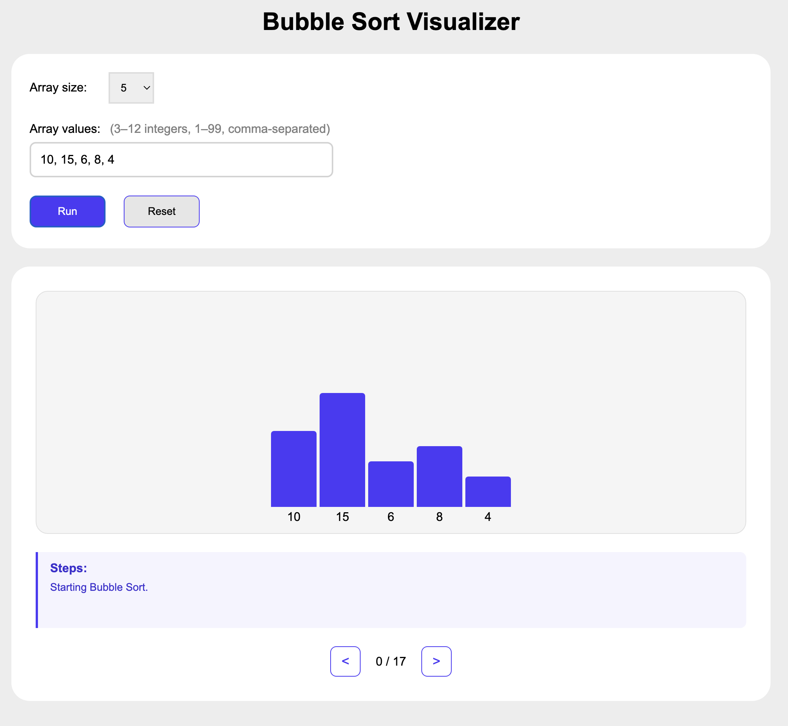

# 🌟 Bubble Sort Visualizer

An interactive visualization of the Bubble Sort algorithm built with a step-by-step interface that makes it easy to understand how Bubble Sort compares and swaps elements.

---

## 📓 Features
- Real-time visualization of Bubble Sort
- Entering your own array of numbers
- Stepping through the algorithm one operation at a time
- Navigating both forward and backward using arrow controls
- Clear visual representation of array elements  

---

## 🛠️ Tech Stack
- **Backend:** Java 25, Spring Boot 4 
- **Frontend:** HTML, CSS, JavaScript
- **Build tool:** Maven 

---

## 🚀 How It Works
- Enter the size of array you want to sort
- Enter array values
- The application renders each value as a bar whose height represents its value  
- Use the navigation arrows to move through each step of the Bubble Sort algorithm
- Move backward at any time to review previous steps

